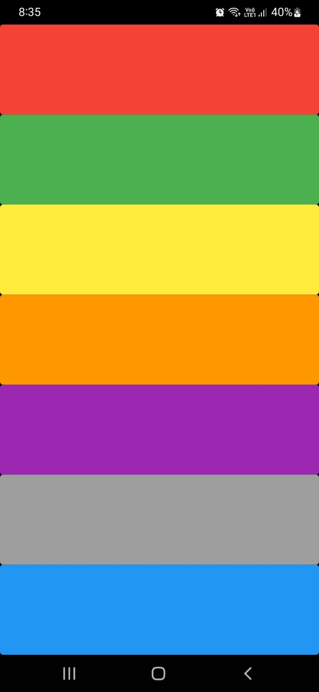

# Xylophone Composer


# Screenshot




Xylophone Composer is a simple cross-platform Flutter application that allows users to compose independent music using a virtual xylophone. Create your own melodies, play tunes, and have fun making music!

## Features

- **Virtual Xylophone:** Enjoy the experience of playing a xylophone right on your mobile device or tablet.

- **Compose Music:** Create your own musical compositions by tapping on the xylophone keys to produce different notes.


## Installation

To run the Xylophone Composer app, follow these steps:

1. Clone this repository to your local machine:

```bash
git clone https://github.com/R0yal-Prince/xylophone.git
cd xylophone
```

Make sure you have the necessary emulators or devices set up for Android and iOS development.

# Usage
Launch the app on your mobile device or emulator.

Tap on the xylophone keys to create musical notes.

Experiment and compose your own tunes!


# Contributing
Contributions are welcome! If you'd like to contribute to the development of the Xylophone Composer app, please follow our contributing guidelines.

# License
This project is licensed under the MIT License .

# Acknowledgments
We would like to thank the Flutter community and the developers who contributed to the libraries used in this project.

